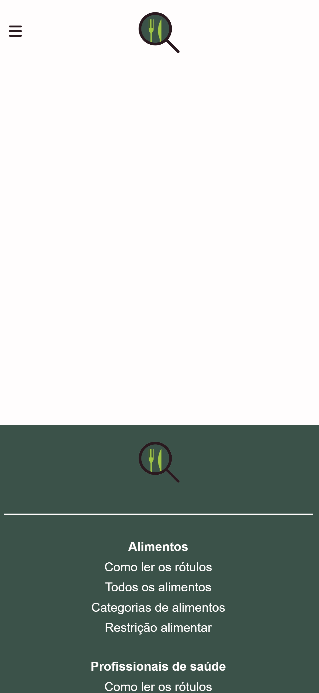

# Template padrão do site

Layout padrão do site (HTML e CSS) que será utilizado em todas as páginas com a definição de identidade visual, aspectos de responsividade e iconografia.

Explique as guias de estilo utilizadas no seu projeto.

## Design

O template padrão da plataforma está localizado no diretório src/index.html. Os arquivos de estilo que controlam a aparência do template estão organizados da seguinte maneira:

    src/css/main.css: Contém os estilos globais que se aplicam a todas as páginas da plataforma.
    src/css/home.css: Contém os estilos específicos para a página inicial.

Essa estrutura facilita a organização e a manutenção dos estilos da plataforma. Permite que os estilos globais sejam aplicados de forma consistente em todas as páginas, enquanto os estilos específicos da página inicial podem ser personalizados sem afetar o restante do site.

Versão Mobile  

Versão Desktop

## Cores

A paleta de cores combina tons de verde associados à saúde e vitalidade com a energia do laranja coral que transmite uma sensação de acolhimento, se equilibrando com a neutralidade do branco e a estabilidade do marrom escuro. Juntos, esses elementos podem criar uma experiência visualmente atraente e informativa para os usuários que buscam aprender sobre rótulos e dietas saudáveis.

## Tipografia

No site será utilizada a seguinte fonte:

Inter - (font-family: "Inter", sans-serif; font-optical-sizing: auto; font-weight: <weight>; font-style: normal; font-variation-settings: "slnt" 0;)

## Iconografia

### 1- Logo do Rótulo Certo
o ícone tem a função de mostrar a logo do site

### 2- Ícone de telefone
O icone terá a função de mostrar o telefone dos nutricionistas

### 3- Ícone de estrela
O ícone tem a função de mostra em quão alto está avaliado o item

