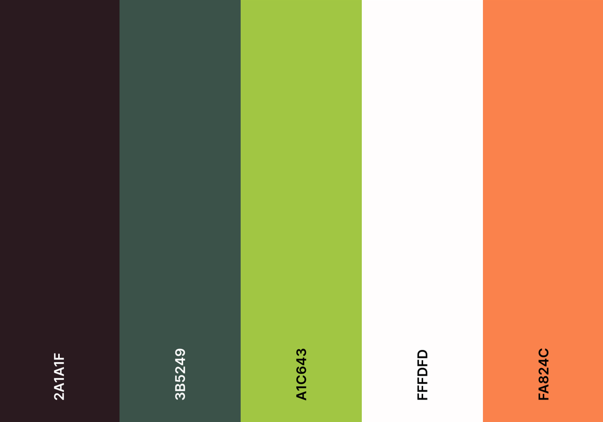

# Template padrão do site

Layout padrão do site (HTML e CSS) que será utilizado em todas as páginas com a definição de identidade visual, aspectos de responsividade e iconografia.

Explique as guias de estilo utilizadas no seu projeto.

## Design

Detalhe os layouts que serão utilizados. Apresente onde será colocado o logo do sistema. Defina os menus padrões, entre outras coisas.

## Cores

A paleta de cores combina tons de verde associados à saúde e vitalidade com a energia do laranja coral que transmite uma sensação de acolhimento, se equilibrando com a neutralidade do branco e a estabilidade do marrom escuro. Juntos, esses elementos podem criar uma experiência visualmente atraente e informativa para os usuários que buscam aprender sobre rótulos e dietas saudáveis.

## Tipografia

No site será utilizada a seguinte fonte:

Inter - (font-family: "Inter", sans-serif; font-optical-sizing: auto; font-weight: <weight>; font-style: normal; font-variation-settings: "slnt" 0;)

## Iconografia

### 1- Logo do Rótulo Certo
o ícone tem a função de mostrar a logo do site

### 2- Ícone calendário
O icone terá a função de permitir ao usuário a encontrar nutricionistas proximos após o teste de IMC

### 3- Ícone de telefone
O icone terá a função de mostrar o telefone dos nutricionistas

### 4- Ícone de estrela
O ícone tem a função de mostra em quão alto está avaliado o item

