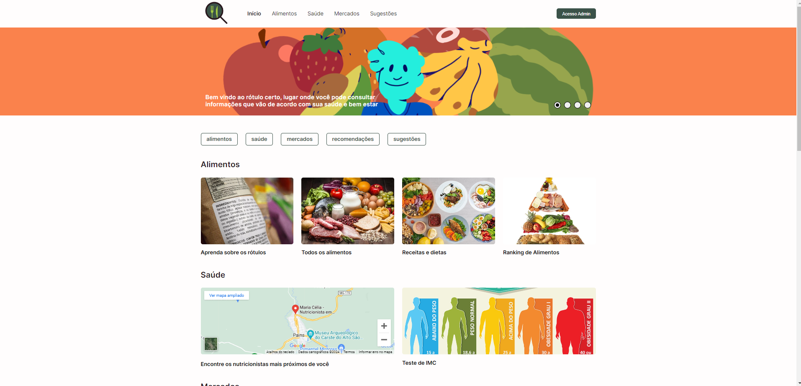

# Apresentação

Na primeira apresentação, definimos o problema que seria abordado no projeto, os objetivos que desejamos atingir durante o desenvolvimento da aplicação e foram trazidos os requisitos funcionais.

Na apresentação final, trouxemos os objetivos e o problema que foram resolvidos durante o desenvolvimento da aplicação e também um vídeo que demonstra o funcionamento do site.

* [Rótulo Certo - Pitch inicial](./rotulo-certo-pitch-inicial.pdf)
* [Rótulo Certo - Apresentação final](./rotulo-certo-slides-presentation.pdf)
* [Rótulo Certo - Video de demonstração](./rotulo-certo-apresentaca-final-video.mp4)

## Título do Projeto

Rótulo Certo

## Identidade Visual (Marca, Design)

